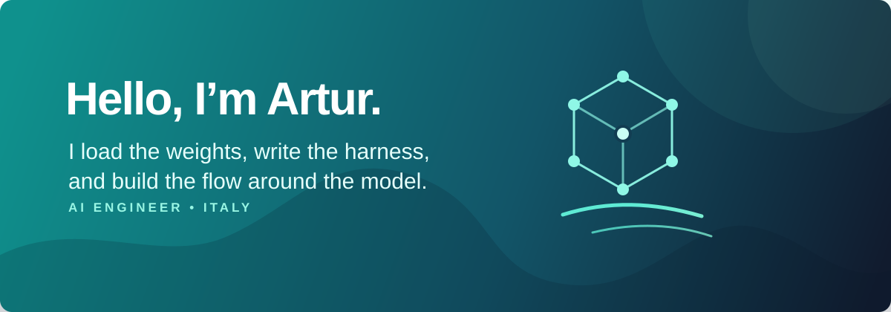
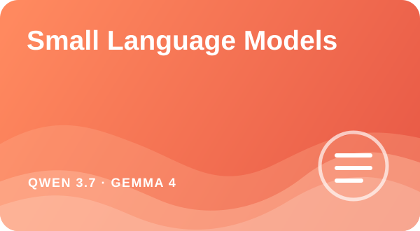
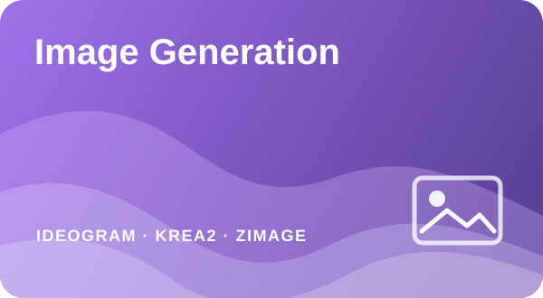
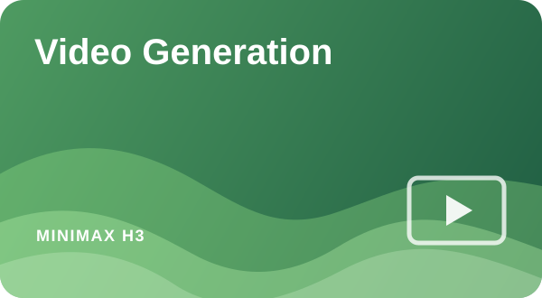
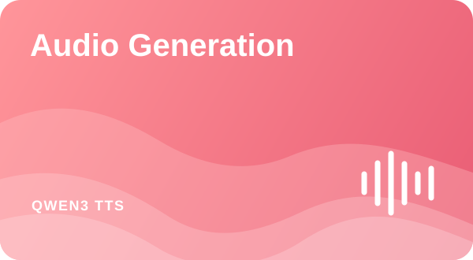

<!--
  This is a GitHub profile README starter.
  Put README.md and the assets/ directory in a public repository named exactly
  after your GitHub username. GitHub will show it at the top of your profile.
-->

  

 

## A little about me

I like getting underneath the chat window. I work with small language models that I run locally, loading weights, writing small harnesses, making the tools, and seeing what happens when the pieces start working together.

With image, audio, and video generation, I take the same hands-on approach. I run the models locally and work close to them, shaping the workflow through parameters, tools, and the way each step feeds into the next.

I enjoy creating more involved creative flows where every piece has a reason to be there. It is less about getting one good prompt and more about building an AI soul: a system I can tune, give direction, and make feel intentional.

## My preferred models

<table>
  <tr>
    <td width="50%"></td>
    <td width="50%"></td>
  </tr>
  <tr>
    <td width="50%"></td>
    <td width="50%"></td>
  </tr>
</table>

## Toolbox

  
   
  
  

## Selected work

  
   
  A voice in the room that never runs out of things to say.

---

Contacts

