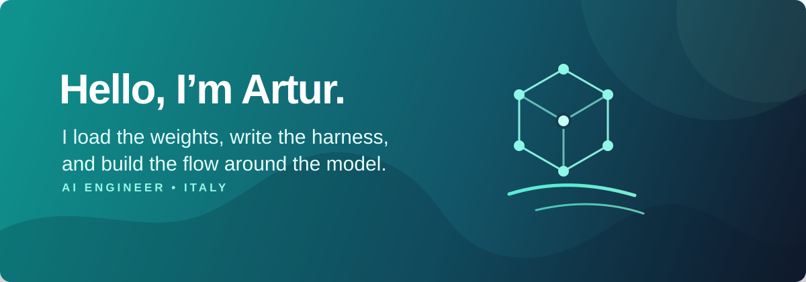
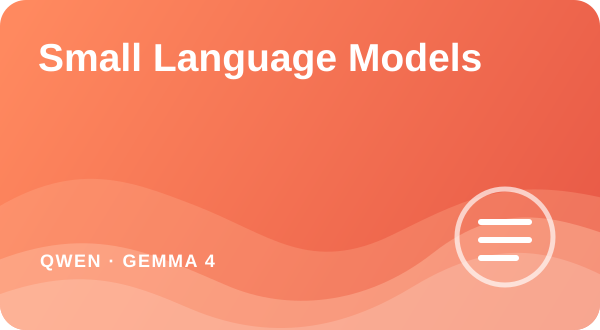
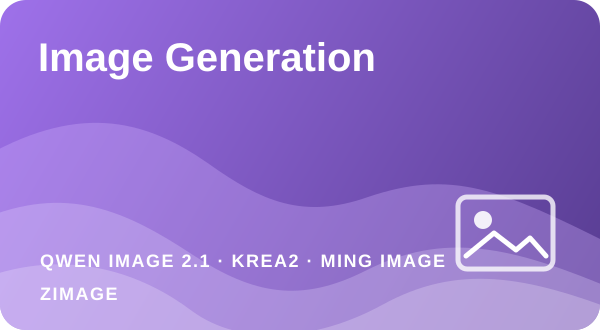
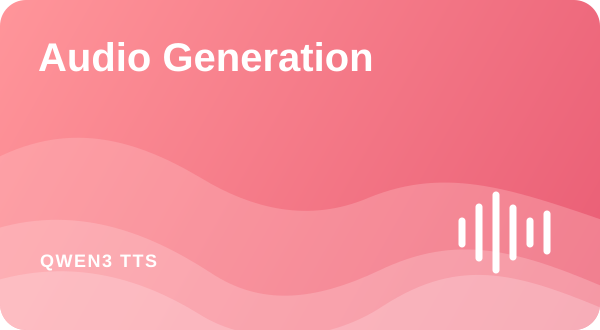
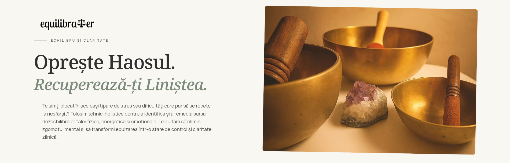
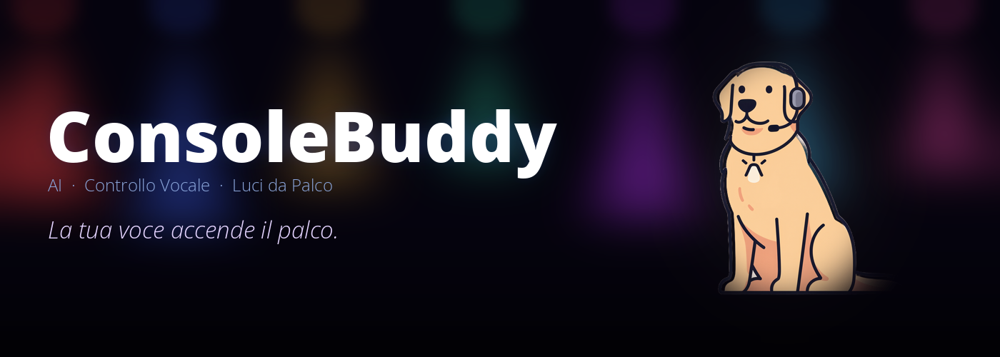
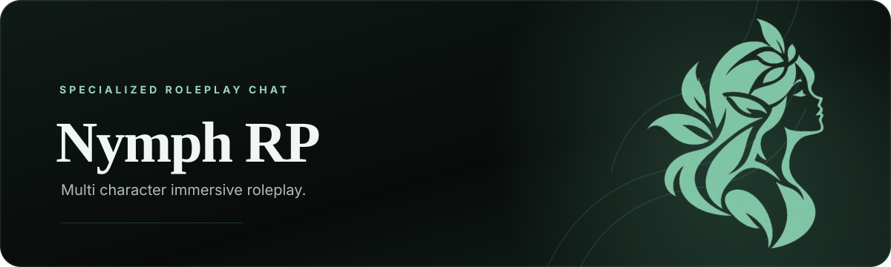

 

## My preferred models

<table>
  <tr>
    <td width="50%"></td>
    <td width="50%"></td>
  </tr>
  <tr>
    <td width="50%"></td>
    <td width="50%"></td>
  </tr>
</table>

## Toolbox

  
   
  
  

## Projects

### [Yapper](https://github.com/arturmarton/yapper)

A conversational voice companion designed to always have something to say.

### [Equilibrater](https://equilibrater.ro/)

A showcase website for Equilibrater.

### [Console Buddy](#)

AI lights technician for concerts

### [Nymph RP](#)

A specialized chat for multi characters roleplay.

---

Contacts

